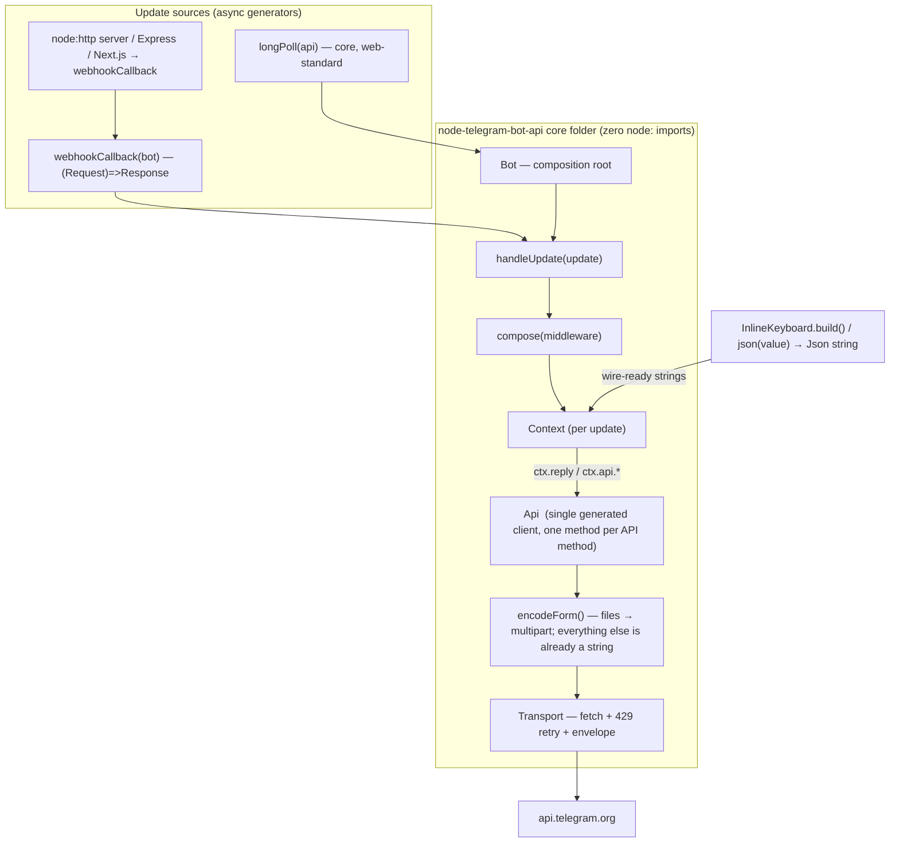

# Architecture Redesign — `node-telegram-bot-api` v2

**Status:** Proposed (design only — no implementation yet)
**Date:** 2026-06-15
**Author:** Yago Pérez
**Scope:** Full from-scratch redesign. Major breaking changes. **No backward compatibility** with the v1 surface.

---

## 1. Summary

v1 is a single ~2,950-line `TelegramBot` class that extends `EventEmitter`, normalizes every payload through a family of hand-written `_fix*` helpers, and hard-couples polling, webhooks, and file uploads to Node APIs (`node:http`, `node:https`, `node:fs`). It cannot run on Cloudflare Workers / Deno Deploy / Vercel Edge, it has no composition story, and adding a Bot API method means writing another method body plus remembering to extend the right `_fix*` step.

v2 keeps what works (generated, docs-faithful types; a thin fetch transport; the `{ok,result}` envelope contract) and rebuilds the rest around these decisions:

1. **Generator-based dispatch.** The update stream is an `AsyncGenerator<Update>`. The bespoke polling class with its manual scheduling, abort flags, and "offset infinite loop" workaround disappears.
2. **Middleware + Context.** A composed middleware chain (koa-style) over a per-update `Context` replaces ad-hoc `EventEmitter` subscriptions, so sessions, auth, rate-limiting, and error boundaries can wrap one another.
3. **One generated client class, no Proxy.** A single `Api` class has one concrete, single-argument method per Bot API method. There is **no `RawApi`/`Api` split** — see decision 4 for why it isn't needed.
4. **The request pipeline performs no serialization.** Structured fields (`reply_markup`, entities, …) are typed as **branded `Json<T>` strings**: their values arrive already wire-ready. Serialization still happens — but **at the call site, in the builders** (`new InlineKeyboard()…build()`) or the generic `json(value)`, never in the request pipeline. The transport and encoder never stringify anything — which is exactly what removes the need for a second client layer. No `_fix*`, no pipeline serialize step.
5. **Runtime-agnostic core, one package.** The core imports only Web-standard APIs. The package keeps the name **`node-telegram-bot-api`** and ships as one install with [subpath exports](https://nodejs.org/api/packages.html#subpath-exports) (`.`, `./node`, `./types`); the core-vs-node isolation is enforced by **CI, not a package boundary**.
6. **Uniform request encoding.** Every call goes out as form encoding — `x-www-form-urlencoded` without files, `multipart/form-data` with them. No JSON body, no per-call body-type branching beyond "is a file present" (ADR-010).

---

## 2. Goals & constraints

**Goals (in priority order, per the design brief):**

- **Developer ergonomics** — less boilerplate, full autocomplete, sensible defaults, one obvious way to do each thing.
- **Runtime-agnostic core** — runs unchanged on Node 18+, Bun, Deno, and edge/serverless (Cloudflare Workers, Vercel Edge, Deno Deploy).
- **Type-safety & inference** — discriminated-union updates; a single generated client class; structured arguments are branded `Json<T>` strings so the compiler rejects an unbuilt or arbitrary string.

**Non-goals:**

- v1 API compatibility. The `TelegramBot` god-class, positional method args, the `EventEmitter` events, and the `_fix*`/`filepath` behaviors are all removed. A short "v1→v2 cheatsheet" ships with the release; there is no shim.
- Reimplementing the type generator. `scripts/api-parser.ts` stays; it gains a discriminated `Update`, emits the single generated client surface (ADR-001) with structured fields typed as `Json<T>` (ADR-002), and expands `MessageEntity` coverage to drive the entity helpers (§6.3).

**Hard constraints the design must satisfy:**

- The core source folder must have **zero `node:*` imports** (CI-enforced, since core and Node helpers ship in one package).
- Every Bot API method must be reachable with **no hand-written per-method body** (generated onto the single `Api` class).
- Every `Api` method takes a single **params** argument plus an optional trailing `AbortSignal` — e.g. `getMe(signal?)`, `sendMessage(params, signal?)`.
- The request pipeline performs **no serialization**: values arrive wire-ready (serialization is done at the call site, in the builders).
- Webhook handling must be a pure `(Request) => Promise<Response>`, and also mountable on an existing Express app or Next.js route.

---

## 3. What's wrong with v1 (the forces)

| Area | v1 today | Problem |
|------|----------|---------|
| Method surface | `telegram.ts`, one hand-written body per method (~2,950 lines) | Every new API method = new body; drift from docs; huge review surface |
| Serialization | `_fixReplyMarkup`, `_fixEntitiesField`, `_fixReplyParameters`, `_fixLinkPreviewOptions`, `_fixStoryAreas`, `_fixMessageIds`, `_fixSuggestedPostParameters`, `_fixJsonFields` | A named helper per structured field; "remember to add a `_fix*` step" is a documented footgun |
| Dispatch | `EventEmitter` + `onText`/`onReplyToMessage` arrays | No composition, no short-circuit, no wrapping, no ordering guarantees, untyped string events |
| Updates source | `TelegramBotPolling`: `setTimeout` scheduling, `_abort`, `_activeRequest`, `_scheduleNext`, offset-loop workaround | Heavy stateful machinery for what is conceptually `while (running) yield* updates` |
| Webhooks | `TelegramBotWebHook` over `node:http`/`node:https`, `readFileSync` for TLS | Cannot run on any edge/serverless runtime |
| Files | `prepareFile` uses `fs.existsSync`/`createReadStream`; bare string is path *or* file_id depending on ambient `options.filepath` | Node-only; ambiguous; surprising |
| Update typing | `Update` is one all-optional object | `update.message` is always `Message \| undefined`; no narrowing |
| Errors | `FatalError` overwrites `.stack`; everything stringified into a message | Loses `cause`; callers substring-match messages |

---

## 4. The new architecture at a glance



Two entry points, **one dispatch path**: `bot.start(source)` pumps a generator for long-running processes; `bot.handleUpdate(update)` handles a single update and is what the Worker/edge callback calls. Both build a `Context` and run the same composed chain. Structured arguments are serialized **before** they reach the client, by the builders/`json()` at the call site — the client and encoder only ever move strings.

---

## 5. Package layout

**One published package — `node-telegram-bot-api`.** The monolith is split into subfolders inside `src/`, exposed through [subpath exports](https://nodejs.org/api/packages.html#subpath-exports). It stays a single `npm install`; the core-vs-node isolation is enforced by **CI, not a package boundary**.

```
src/
  core/      runtime-agnostic. Bot, Context, compose, the single Api client class,
             Transport, encodeForm (no serialization), files
             (Blob/Uint8Array/stream), markup + entity builders, the json() helper,
             longPoll, webhookCallback, framework webhook adapters (Express/Next.js), errors.
             → zero node:* imports; runs on Node / Bun / Deno / Workers / edge.
  node/      Node-only sugar: fromPath() (fs uploads), createWebhookServer()
             (node:http → delegates to core's webhookCallback), optional managed
             polling runner. THE ONLY folder allowed to import node:*.
  types/     the generated schema (re-exported by core): discriminated Update,
             the generated Api method signatures, Json<T> field aliases, expanded MessageEntity.
```

```jsonc
// package.json
"exports": {
  ".":       { "types": "./dist/core/index.d.ts",  "import": "./dist/core/index.js" },
  "./node":  { "types": "./dist/node/index.d.ts",  "import": "./dist/node/index.js" },
  "./types": { "types": "./dist/types/index.d.ts", "import": "./dist/types/index.js" }
}
```

So `import { Bot } from "node-telegram-bot-api"` is the runtime-agnostic core, and `import { fromPath } from "node-telegram-bot-api/node"` opts into the Node helpers. **CI rule:** a lint gate fails the build if anything under `src/core/` imports `node:` (or a transitively Node-only module), so the edge bundle never drags in Node polyfills even though everything lives in one package. (See ADR-009.)

---

## 6. Core concepts

### 6.1 The API client — one generated `Api` class, single-argument methods

The 2,950-line god-class becomes **one generated class** with concrete methods (no `Proxy`, no second layer):

```ts
class Api {
  constructor(token: string, options?: TransportOptions);

  // shared, non-generated plumbing:
  protected request<M>(method: M, params: ParamsOf<M>, signal?: AbortSignal): Promise<ResultOf<M>>;

  // GENERATED — one concrete method per Bot API method: a single params
  // argument plus an optional trailing AbortSignal (params-less methods take
  // just the signal):
  getMe(signal?: AbortSignal): Promise<User>;
  getUpdates(params?: GetUpdatesParams, signal?: AbortSignal): Promise<Update[]>;
  sendMessage(params: SendMessageParams, signal?: AbortSignal): Promise<Message>;
  sendPhoto(params: SendPhotoParams, signal?: AbortSignal): Promise<Message>;
  // …one per documented method; each body is just `return this.request("name", params, signal)`
}
```

There is **no `RawApi`/`Api` split**. The only thing a second layer would have done was serialize arguments before delegating; since serialization happens at the call site rather than in the request pipeline (§6.2), there is nothing for it to do, so one class suffices. `Bot` holds an `Api`; `ctx.api` and `bot.api` expose it.

Why a class over a `Proxy`: real methods give correct stack traces, are greppable and debuggable, and need no `as` casts to type. Adding a Bot API method means regenerating `Api` — still no hand-written body. Positional sugar (`reply(text)`) lives on `Context`, keeping the client a clean mirror of the wire API. (gotgbot in Go takes exactly this generated-concrete-method approach — see [`RESEARCH-go-rust-clients.md`](./RESEARCH-go-rust-clients.md).)

This does **not** tree-shake per method: a single instantiated `Api` class ships all ~180 methods regardless of which a given bot calls, since they're instance methods reachable from the constructed object. The class is still chosen for the reasons above (stack traces, greppability, no casts), not for dead-code elimination. Per-method DCE would require a free-function surface (`sendMessage(client, params)`) where unused functions drop out of the bundle — a considered alternative, rejected here for the worse call-site ergonomics and the loss of a single discoverable `api.*` namespace.

### 6.2 Serialization — branded `Json<T>` strings; the pipeline serializes nothing

Telegram's wire wants structured fields (`reply_markup`, entities, `reply_parameters`, …) as **JSON-serialized strings** on the form body. v2 takes that literally: those fields are **typed as strings**, and the value is serialized **at the call site, in the builders**, before it ever reaches the client. Serialization is not absent — it has moved out of the request pipeline. The transport and encoder only ever move strings.

To keep that safe (a bare `string` would accept any text), the string is **branded**:

```ts
type Json<T> = string & { readonly __json: T };   // zero-cost brand; still a string at runtime

// generated param field:  reply_markup?: Json<InlineKeyboardSpec>

class InlineKeyboard {
  build(): Json<InlineKeyboardSpec> { return JSON.stringify(this.spec) as Json<InlineKeyboardSpec>; }
}
function json<T>(value: T): Json<T> { return JSON.stringify(value) as Json<T>; }
```

A field typed `Json<InlineKeyboardSpec>` only accepts something a builder or `json()` produced — `reply_markup: "hello"` and `reply_markup: { inline_keyboard: [] }` are both type errors. Call sites read:

```ts
ctx.reply("hi", { reply_markup: new InlineKeyboard().text("A", "a").row().url("Docs", URL).build() });
ctx.reply("hi", { reply_markup: json({ inline_keyboard: [[{ text: "A", callback_data: "a" }]] }) });
```

Consequences:

- **The encoder is trivial** — per field it does one of three things: attach an `InputFile` as a multipart part, let a file-carrying composite write itself (§6.4), or set a string (`Json<T>` and scalars alike). No `JSON.stringify` in the pipeline, no `_fix*`, no field map, no marker interface.
- **The client never needs to understand a structured shape** — good for forward-compat when Telegram adds keyboard/entity fields; only the builder/types change.
- **"Which fields are structured" lives in the generator** (it emits `Json<T>` aliases at compile time), not in any runtime step.
- `json()` is the universal escape hatch for fields without a bespoke builder (`reply_parameters`, `link_preview_options`, …); builders are sugar on top of it.

The accepted cost: `.build()` / `json()` appears at every structured call site, and you cannot pass a builder instance or plain object directly (accepting those would reintroduce a library serialize step). This is the deliberate trade — a verbatim-wire SDK with a pure, serialization-free core. (The considered alternative — letting the encoder do one `JSON.stringify` so call sites skip `.build()` — is noted in ADR-002.)

### 6.3 MessageEntity — expanded types + helpers

The api-parser's `MessageEntity` coverage is expanded to emit the full object (including `url`, `user`, `language`, `custom_emoji_id`). On top of that the library provides ergonomics so callers never hand-count UTF-16 offsets:

- **`EntityType`** — a constant for every documented entity kind (`EntityType.Bold`, …), typo-proof versus raw strings.
- **`fmt()` / `EntityBuilder`** — a fluent builder that accumulates text and tracks offsets, and whose `.build()` returns `{ text: string; entities: Json<MessageEntity[]> }` — the entity list already serialized, ready to drop into `sendMessage`.

```ts
const { text, entities } = fmt().plain("Hello ").bold("world").link("docs", url).build();
await ctx.reply(text, { entities });   // `entities` is a Json<MessageEntity[]>
```

### 6.4 Files — `InputFile` and multipart

`InputFile` is the one value that can't be a pre-serialized `Json<T>` string (you can't JSON-encode a `Blob`), so it has its own path. It's an explicit, web-standard wrapper — no `fs`, no path-guessing:

```ts
class InputFile {
  constructor(
    readonly data: Blob | Uint8Array | ReadableStream<Uint8Array>,
    readonly meta?: { filename?: string; contentType?: string },
  ) {}
}
const inputFile = (data, meta?) => new InputFile(data, meta);

// node subpath only:
async function fromPath(path: string, meta?): Promise<InputFile>;   // fs → Blob/stream
```

File-bearing params are typed **`InputFile | string`**, where a string is always a `file_id` or URL (ADR-006) — both go on the wire as-is, no upload.

**The encoder has three branches** (and nothing else):

```ts
for (const [key, v] of fields) {
  if (v == null)           continue;
  else if (isInputFile(v)) form.attach(key, v);    // upload → multipart part
  else if (isFormPart(v))  v.writeTo(form);          // file-carrying composite (media groups)
  else                     form.set(key, String(v)); // Json<T> strings + scalars
}
```

- **The presence of any `InputFile` is the only thing that flips a request to `multipart/form-data`** (ADR-010); otherwise it stays `x-www-form-urlencoded`.
- **Top-level file params** (`photo`, `document`, `thumbnail`, …) are sent as a multipart part named after the parameter — the documented "upload under the field name" convention. A `file_id`/URL string just goes in as a normal field.

**Nested files (e.g. `sendMediaGroup`)** are the one case where a JSON array must reference files by `attach://<name>` while the bytes travel as separate parts. This is handled by a builder, so the "pipeline serializes nothing" rule still holds:

```ts
mediaGroup()
  .photo(inputFile(bytesA), { caption: "A" })
  .photo("https://example.com/b.jpg")    // URL → no upload
  .build();
```

`mediaGroup().build()` serializes **at the call site** (like every other builder): it mints `attach://` names, JSON-stringifies the array with those references, and returns a small *form-part payload* carrying both the `Json` string and the keyed `InputFile`s. The encoder's `writeTo(form)` branch then sets the `media` field to that string and registers each part — it still stringifies nothing. The builder serializes; the encoder only moves strings and files. (See ADR-011.)

Runtime note: `Blob`/`Uint8Array`/`ReadableStream` exist on Node 18+, Bun, Deno, and Workers, so uploads work on the edge too; `fromPath()` is the only Node-only piece and lives in `./node`.

### 6.5 Dispatch — async generators

Update sources are async generators. `longPoll(api, opts, signal)` is ~20 lines and replaces the entire polling class: the loop, offset tracking, and cancellation are just the shape of a generator plus an `AbortSignal`. Because it's a plain async iterable, consumers can `for await` it directly, `take(n)`, filter, batch, or fan out to workers.

### 6.6 Middleware + Context

`compose()` is the koa-compose algorithm, typed. `bot.use(mw)` registers middleware; `bot.on(kind)`, `bot.command(name)`, `bot.hears(trigger)` are filter middleware so they interleave with `use()` and obey order. Each middleware can wrap everything downstream via `await next()` — enabling timing, error boundaries, sessions, auth. `Context` bundles the raw `update`, the typed `api` (the single `Api`), a mutable `state` bag, and shortcuts (`ctx.reply`, `ctx.answerCallbackQuery`) that infer the chat from the update.

### 6.7 Webhooks — edge callback + framework adapters

The web-standard `webhookCallback(bot)` is a pure `(Request) => Promise<Response>`: verify the secret-token header, parse one update, run `bot.handleUpdate`, return a `Response`. That single function covers Cloudflare Workers, Deno Deploy, Vercel Edge, Bun.serve — and Next.js App Router (which speaks `Request`/`Response` natively). Thin adapters mount the bot on a server you already have:

- **`registerExpressWebhook(bot, app, { path, secretToken })`** — registers the route on an already-instantiated Express app.
- **`nodeFrameworkWebhook(bot, opts)`** — an `(req, res)` handler for Express / Connect / Next.js Pages API routes.
- **`nextAppWebhook(bot, opts)`** — the App Router handler (`export const POST = …`); it is the core callback verbatim.

The Node `createWebhookServer` (a self-hosted `node:http` server) also just adapts the request and delegates to the same callback — no duplicate request-handling logic anywhere.

### 6.8 Transport & errors

`Transport` is the only module touching `fetch`; it is injectable (`opts.fetch`) so unit tests pass a fake instead of monkeypatching `globalThis.fetch`. It merges the per-request timeout with the caller's signal via a hand-rolled `combineSignals` helper over `AbortSignal.timeout(ms)` — **not** `AbortSignal.any`, whose named API only landed in Node 18.17/20.3, while `AbortSignal.timeout` has existed since Node 17.3, so the mechanism is fully covered at the Node ≥18 floor. It then unwraps the envelope and retries.

Retry policy: `429`s honor `retry_after` first; transient failures (a fetch-throw → `NetworkError`, our own `TimeoutError`, and HTTP 5xx → `TelegramApiError` with `errorCode ≥ 500`) are also retried, bounded by `maxRetries` (default 2). Non-429 backoff is exponential — `retryBackoffMs * 2^(attempt-1)` (default base 300 ms), capped at 30 000 ms, with 50–100% jitter. `isTransientError(err)` in `errors.ts` is the shared classifier (true for `NetworkError`/`TimeoutError`/`TelegramApiError` with code ≥ 500). The transport also supports **opt-in proactive rate limiting** (`opts.rateLimit: { global?, perChat? }`, requests/sec) via a token-bucket `RateLimiter` keyed on `params.chat_id` — off by default with zero overhead when unset (M3).

Errors preserve `cause` and expose structured fields: `TelegramApiError` carries `errorCode`/`description`/`parameters` (and a `retryAfter` getter) so callers branch on values, not message substrings.

**Runtime support matrix** (the core uses only Web-standard APIs):

| Runtime | Supported | Notes |
|---------|-----------|-------|
| Node | ≥ 18 | global `fetch`/`Blob`/`FormData` are stable from 18; `AbortSignal.timeout` from 17.3, so it's covered. (`AbortSignal.any` is deliberately avoided — it needs 18.17/20.3.) |
| Bun | ✓ | Web APIs native. |
| Deno | ✓ | Web APIs native. |
| Cloudflare Workers | ✓ | edge target; `webhookCallback` is a pure `(Request)=>Response`. |
| Vercel Edge | ✓ | as above. |
| Deno Deploy | ✓ | as above. |

`fromPath()` and the self-hosted `node:http` server are the only Node-floor-bound pieces and live in `./node`.

---

## 7. Breaking changes (explicit)

Backward compatibility is dropped, so these are intentional:

1. **No `TelegramBot` class / no default export.** Use `new Bot(token, options)` from `node-telegram-bot-api`; the low-level client is the single `Api` class.
2. **No `EventEmitter`.** `bot.on('message', …)` is now a router, not an event subscription. `onText` → `bot.hears`; `onReplyToMessage` → middleware on `ctx.message.reply_to_message`.
3. **Single-argument methods.** Every `Api` method takes one params object. `sendMessage(chatId, text, opts)` → `api.sendMessage({ chat_id, text, … })` or `ctx.reply(text)`.
4. **Structured args are branded `Json<T>` strings.** `reply_markup`/entities/etc. take the output of a builder (`new InlineKeyboard()…build()`) or `json(value)`. Passing a plain object or a bare string is a type error. The `_fix*` pipeline and any pipeline-side serialization are gone (serialization moves to the builders at the call site).
5. **File inputs:** bare strings are never paths. Use `inputFile(bytes)` or `fromPath(path)`. `options.filepath` is gone.
6. **Webhooks:** `TelegramBotWebHook` → `webhookCallback(bot)` in core, `createWebhookServer(bot)` in `node-telegram-bot-api/node`, or `registerExpressWebhook` / `nextAppWebhook` to mount on an existing server.
7. **Polling:** `TelegramBotPolling` and `startPolling`/`stopPolling`/`isPolling` → `bot.start()`/`bot.stop()` or `longPoll()` directly.
8. **Errors:** `EFATAL` splits into `NetworkError`/`TimeoutError`; `TelegramError` → `TelegramApiError` with structured fields. `.code` strings are preserved.
9. **`Update` is a discriminated union** — `update.message` only exists on the message variant.
10. **ESM-only, web-standard.** No CommonJS build. Node floor stays at 18 (first LTS with stable global `fetch`). Subpath exports: core at `.`, Node helpers at `./node`.

---

## 8. Architecture Decision Records

### ADR-001 — One generated `Api` class (no Proxy, no hand-written bodies, no Raw/Api split)

**Context.** 2,950 lines of near-identical method bodies; each new Bot API method is manual work and a review burden. An earlier draft proposed two layers (`RawApi` for the wire, `Api` for serialization + ergonomics).
**Decision.** Generate concrete methods onto **one** `Api` class (each a one-liner over a shared `request()`). Single argument per method. No `Proxy`. The `RawApi`/`Api` split is dropped: its only job was to serialize arguments, and the library no longer serializes anything (ADR-002).

| Option | Maintenance | Type-safety | DX / debuggability | Layers |
|--------|-------------|-------------|--------------------|--------|
| A. Hand-written bodies | High (per method) | Good | Familiar | 1 |
| B. Generic map + `Proxy` | Near-zero | Good (needs casts) | Poor stack traces, not greppable | 1 |
| C. Generated concrete methods, two layers | Near-zero | Excellent | Real methods | 2 (`RawApi`+`Api`) |
| D. **Generated concrete methods, one class** | Near-zero | Excellent | Real methods | **1** |

**Decision: D.** Rejected B (Proxy) for poor stack traces and casts; rejected C's second layer as unnecessary once serialization left the pipeline. Pros: smallest surface, plain debuggable OO, methods can't drift from types. Cons: generated output larger than a Proxy, and — because the methods are instance methods on one constructed object — the whole client ships regardless of which methods a bot calls (no per-method tree-shaking; see §6.1). Both acceptable: the output is mechanical, and per-method dead-code elimination would need a free-function surface we rejected for worse ergonomics. (Direct precedent: gotgbot generates concrete methods in Go; see the research note.)

### ADR-002 — Structured args are branded `Json<T>` strings; the pipeline serializes nothing

**Context.** v1's eight `_fix*` helpers stringified named fields, a documented maintenance footgun. The Bot API documents these fields as "A JSON-serialized object" — i.e. strings on the wire.

| Option | Where serialization happens | Type-safety | Call-site cost | Library complexity |
|--------|-----------------------------|-------------|----------------|--------------------|
| A. Generic stringify in encoder | library, per request | low (`interface{}`-ish) | none | a serialize step |
| B. Generated field map | library, per request | medium | none | a serialize step + map |
| C. `Serializable.serialize()` values | library calls `serialize()` | high | none | a serialize step |
| D. `toJSON()` + encoder `JSON.stringify` | library, one line | high | none (`.build()` optional) | one line |
| E. **Branded `Json<T>` strings, built at call site** | **at the call site** | **high** | **`.build()`/`json()` per field** | **none** |

**Decision: E.** Structured fields are typed `Json<T>` (a branded string). Values are produced by builders (`InlineKeyboard`, the `fmt()` entity builder) or the generic `json(value)`, both of which `JSON.stringify` eagerly and return the branded string. The request pipeline performs **no serialization**: `encodeForm` writes strings and extracts `InputFile`s, nothing more.

**Consequences.** Zero serialization code in the hot path; the client is decoupled from every structured shape (forward-compatible); the "which fields are JSON" knowledge lives in generated `Json<T>` aliases at compile time. The brand is load-bearing — a bare `type X = string` would accept arbitrary text and re-create the "is this secretly JSON?" problem. The brand is, however, only **structural**: it guarantees a value "went through `json()`/`.build()`", not that the value is fully correct — for a permissive, all-optional target shape `T`, `json({})` or a wrongly-shaped-but-assignable object still type-checks. It catches "you forgot to serialize", not "you serialized the wrong thing". Trade-off: callers write `.build()`/`json()` on every structured field, and cannot pass a builder instance or plain object directly (that would require a library serialize step — option D — which we explicitly chose against to keep a single, pure client). Option D remains the fallback if call-site verbosity proves painful: it restores object/builder inputs at the cost of one `JSON.stringify` in the encoder, without bringing back a second client layer.

### ADR-003 — Middleware + Context instead of EventEmitter

**Context.** Cross-cutting behavior (sessions, auth, rate-limit, i18n, error handling) can't compose over events.
**Decision.** koa-compose chain over a per-update `Context`; routing helpers are filter middleware.

| Dimension | EventEmitter (v1) | Middleware (v2) |
|-----------|-------------------|-----------------|
| Composition | None | `await next()` wrapping |
| Short-circuit | No | Yes |
| Ordering | Registration order, no control | Explicit |
| Typing | String events, loose | `Context` + discriminated update |

**Consequences.** Easier: plugins, testing a chain in isolation. Harder: v1 users rethink event handlers. Mitigation: cheatsheet + `bot.on(kind, handler)` mirrors the familiar shape.

### ADR-004 — Update sources as async generators

**Context.** `TelegramBotPolling` is heavy stateful machinery.
**Decision.** `async function* longPoll(api, opts, signal)`; `bot.start()` consumes any `AsyncIterable<Update>`.
**Consequences.** Deletes scheduling/abort/active-request bookkeeping; makes the stream composable (filter/take/fan-out). The "offset infinite loop" workaround becomes an explicit, opt-in error policy. Trade-off: a misbehaving handler can slow the pull loop — documented; concurrency is opt-in via a queue middleware.

### ADR-005 — Web-standard core + Node/edge adapters

**Context.** Goal: run in lambda/Workers. v1 needs `node:http`/`node:fs`.
**Decision.** The core folder uses only Web APIs; `webhookCallback` is `(Request)=>Response`; the `node:http` server and fs uploads live under `./node`; Express/Next.js adapters are thin shims over the same callback.
**Consequences.** One library serves polling bots, edge functions, and existing Express/Next.js servers with shared code. Trade-off: Node users do one extra import (`/node`) for fs/server helpers — acceptable and explicit.

### ADR-006 — Explicit `InputFile`; strings are file_id/URL only

**Context.** `options.filepath` makes a bare string mean path *or* file_id; relies on `fs`.
**Decision.** Uploadables are wrapped (`inputFile(...)`/`fromPath(...)`); strings are always file_id/URL. File-bearing params are typed `InputFile | string`.
**Consequences.** Removes ambiguity and the only fs dependency in the hot path; works on edge. Trade-off: a little more typing for local uploads, in exchange for predictability. The wire mechanics (multipart trigger, `attach://`, nested files) are ADR-011.

### ADR-007 — `Update` as a discriminated union

**Context.** All-optional `Update` blocks narrowing.
**Decision.** Generator emits one variant per payload key.
**Consequences.** `if ('message' in u)` narrows; `Context` getters are sound. Trade-off: generator change + a one-time consumer migration. Two known limits, accepted: the union models "at most one payload key narrows" but does **not** statically enforce *exactly one* payload key (a hand-built `Update` with two payloads, or none, still type-checks); and the ~25-member union noticeably lengthens TS error messages and adds a little to compile time when it appears in inference. Both are cosmetic against the narrowing win.

### ADR-008 — Restructured error hierarchy

**Decision.** `TelegramBotError` base preserving `cause`; `NetworkError`, `TimeoutError`, `ParseError`, `TelegramApiError` (structured). Keep `.code` strings for muscle memory.
**Consequences.** Programmatic branching (`err.errorCode === 429`, `err.retryAfter`) instead of message matching.

### ADR-009 — One package with subpath exports; isolation enforced by CI

**Context.** Core and Node helpers must be cleanly separated, but a multi-package monorepo adds publishing/versioning/install friction — and the package keeps the established name `node-telegram-bot-api`.

| Option | Isolation | Install/versioning | Discoverability |
|--------|-----------|--------------------|-----------------|
| A. Separate packages | package boundary | two packages in lockstep | two names |
| B. **One package, subpath exports + CI lint** | CI rule on `src/core/` | single install, single version | one name, `/node` opt-in |

**Decision: B.** Split into `src/core`, `src/node`, `src/types`; expose `.`, `./node`, `./types` via `package.json` `exports`. A CI lint fails if anything under `src/core/` imports a `node:` (or transitively Node-only) module.
**Consequences.** Edge users get a Node-free bundle from `.`; Node users add `/node`. One version, one changelog, no cross-package lockstep. The boundary is a convention a lint must guard rather than something npm enforces — so the lint is a required, non-optional gate. Ship `sideEffects: false` and per-subpath entry points so bundlers tree-shake the unused half.

### ADR-010 — Uniform form encoding (no JSON request body)

**Context.** The Bot API accepts `application/json`, `x-www-form-urlencoded`, and `multipart/form-data`. teloxide (Rust) sends a JSON body for file-less calls, which would let structured fields stay nested objects and skip per-field serialization (see the research note).

| Option | Body types | Serialization implication |
|--------|-----------|---------------------------|
| A. JSON body when no file, multipart when file | 2 unrelated models | structured fields are nested JSON (no per-field work) for the common case |
| B. **Form encoding always** (urlencoded w/o files, multipart w/ files) | 1 field model (every field a string) | structured fields must be strings — fits the `Json<T>` decision exactly |

**Decision: B.** One field model for every request: every field is a string; multipart only adds file parts. Note the honest framing: for large classes of bots — notification, inline-answer, and text/keyboard bots — file uploads are actually **rare**, so the file-less path (where option A's JSON-body shortcut would apply) is often the *common* case, not the exception. We therefore do **not** anchor this on "uploads are common." We anchor it on **synergy with ADR-002**: structured fields are already `Json<T>` strings produced at the call site, so a single all-strings field model needs no nesting from the body format and adds no per-field work — the JSON-body shortcut would buy nothing that ADR-002 hasn't already bought, while a second body model would add branching. One field model is simply the format that ADR-002 already implies.
**Consequences.** No body-type branching beyond "is a file present." The trade-off — losing JSON-body's automatic nesting — is exactly what ADR-002 already handles by serializing at the call site, regardless of how often a given bot actually uploads.

### ADR-011 — File & multipart handling (`InputFile`, `attach://`, nested uploads)

**Context.** `InputFile` carries binary data, so (unlike every other structured field in ADR-002) it cannot be a pre-serialized `Json<T>` string. The encoder must therefore recognise files, switch the request to multipart, and — for methods that reference files from inside a JSON structure (`sendMediaGroup`, `sendPaidMedia`, input media with thumbnails) — bind those references to the uploaded parts.

**Decision.**
- `InputFile` wraps web-standard data only (`Blob | Uint8Array | ReadableStream<Uint8Array>`); file-bearing params are typed `InputFile | string` (string = `file_id`/URL).
- The encoder has exactly three branches: attach an `InputFile` as a multipart part, let a *form-part composite* write itself, or set a string. Any `InputFile` present switches the body to `multipart/form-data`; otherwise `x-www-form-urlencoded`.
- Top-level file params upload as a part named after the parameter. Files nested in JSON are referenced as `attach://<name>` with a matching part.
- Nested-file methods use a builder (`mediaGroup()`) whose `.build()` serializes at the call site and returns a *form-part payload* = the `Json` array (with `attach://` refs) **plus** the keyed `InputFile`s. The encoder's composite branch sets the JSON field and registers the parts.

**Consequences.** The "pipeline serializes nothing" rule (ADR-002) holds even for media groups — the builder does the serialization; the encoder only moves strings and files. Uploads work on the edge (web-standard data); `fromPath()` is the sole Node-only helper (`./node`). Trade-off: the encoder grows one branch (form-part composites) beyond the string/file pair, and file-carrying composites need a bespoke builder rather than `json()`.

---

## 9. Phased implementation plan

1. **Core skeleton** — `Transport`, `encodeForm` (three branches: file part / form-part composite / string; no serialization), `InputFile`, `errors`; set up `exports` and the `src/core` no-`node:` lint. Unit tests with an injected fetch.
2. **Type generator** — extend `scripts/api-parser.ts` to emit the discriminated `Update`, the generated `Api` method signatures, the `Json<T>` field aliases, `InputFile | string` for file params, and expanded `MessageEntity`.
3. **Builders + `json()`** — `Json<T>`, the generic `json(value)`, the `InlineKeyboard` markup builder, the entity helpers (`EntityType`, `fmt`), and the `mediaGroup()` form-part builder (lands with the media methods).
4. **Client** — generate the single `Api` class over `request()`.
5. **Dispatch** — `compose`, `Context`, `Bot`, `longPoll`, `webhookCallback`.
6. **Node + framework adapters** — `src/node`: `fromPath`, `createWebhookServer`, managed polling; plus `registerExpressWebhook` / `nextAppWebhook` / `nextPagesWebhook`.
7. **Edge validation** — deploy a Worker against a real bot; confirm zero Node polyfills in the bundle.
8. **Integration suite** — reuse v1's throttled live tests against `api.telegram.org`, retargeted to the new client.
9. **Docs & cheatsheet** — v1→v2 migration table; examples for polling, webhook, Worker, Express, Next.js, middleware, uploads.

CI gates throughout: `tsc --strict`, the no-`node:`-in-`src/core` lint, unit tests (no network), and a bundle-size check on the core entry.

---

## 10. Risks & open questions

**Still open:**

- **Call-site verbosity of `.build()`/`json()`.** Mandatory on every structured field (ADR-002). If it proves painful in real bots, the documented fallback is option D (encoder does one `JSON.stringify`, builders/objects accepted directly) — still a single `Api` class.
- **Builder coverage.** Bespoke builders for the high-traffic types (inline/reply keyboards, entities); `json()` covers the rest. Decide which structured types earn a dedicated builder as methods are ported.

**Addressed since the first draft:**

- **Concurrency / flood control.** Was open ("provide an opt-in queue rather than baking it in"). Now: opt-in `TransportOptions.rateLimit: { global?, perChat? }` (requests/sec) backed by a token-bucket `RateLimiter` keyed on `params.chat_id` — off by default, zero overhead when unset (M3, §6.8). Sequential polling remains the default; queue/concurrency middleware is still the composition story for parallel handling.
- **Serverless response timing.** Was open ("expose a hook so handlers can return early"). Now: `WebhookOptions.fastAck` and `WebhookOptions.waitUntil` — validate, return 200 immediately, then run the handler in the background or hand its promise to `waitUntil` (e.g. a Worker's `ctx.waitUntil`); default stays blocking (M6, §6.7).
- **Polling error policy.** Was open (ADR-004's "explicit opt-in error policy"). Now: `longPoll` has `retry` (default on), `maxBackoffMs` (default 60 000), and an `onError` observer; the loop backs off and resumes on transient errors *without advancing the offset*, rethrows fatal 4xx, and returns cleanly on abort. The transport mirrors this for one-off calls (transient retry + exponential backoff, M2, §6.8).

*(Resolved by ADR: keep the name `node-telegram-bot-api`, one package with subpath exports — ADR-009; a single generated `Api` class, no Proxy, no Raw/Api split — ADR-001; structured args as branded `Json<T>` strings built at the call site, pipeline serializes nothing — ADR-002; uniform form encoding, no JSON body — ADR-010; `InputFile`/multipart and nested uploads via `mediaGroup()` — ADR-011; edge isolation enforced by lint + edge-bundle CI — ADR-009/M5.)*
